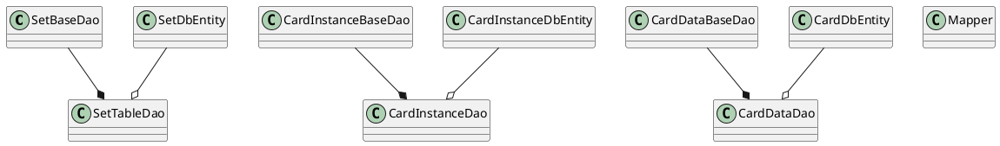
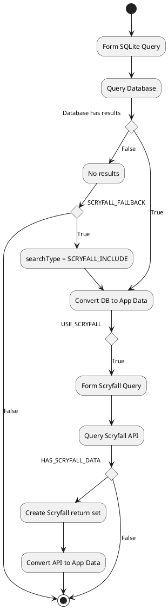

# Application Components
As covered in the [context document](Collection_Manager_Context.md), the application supports a few core functions. Many of the functions are just front ends that all utilize the same data interface. The basic application layout is:

```plantuml
@startuml

!include https://raw.githubusercontent.com/plantuml-stdlib/C4-PlantUML/master/C4_Component.puml

Person(user, "Passionately Casual MTG Player")

System_Boundary(context, "Flutter Desktop App Components") {   
    System_Boundary(collectionManager, "Collection Manager", "Desktop Application") {
        Component(sortableList, "Card List", "Sortable and scrollable")
        Component(search, "Search Interface", "Unified interface", "Option to include Scryfall results. Database-only by default")
        Component(decks, "Deck Management")
        Component(import, "Card Import Manager", "From CSV or MTGA files")
        Component(export, "Card Export Manager", "To CSV or MTGA")
    }
    
    Component(handler, "Query Handler", "Translation, Source Management, DB Syncing", "Triggered by receiving a card query.") {
    } 
            
    ComponentDb(db, "Database", "sqflite", "Multiple tables")
}

System_Ext(scryfall, "Scryfall"){
}

AddRelTag("eventing", $lineStyle = DashedLine())

BiRel(handler, db, "Data Query and Response")

Rel(user, collectionManager, "Card Query", "UI Input")
Rel(scryfall, handler, "API Request", "REST")
Rel(decks, search, "")
Rel(sortableList, search, "")
Rel(search, handler, "")
Rel(sortableList, export, "")
Rel(import, handler, "")

SHOW_LEGEND()

@enduml
```
This document will start detailing the main components and how their internals will function. I'll try to follow some reasonable documentation practices and save the class diagrams for supporting documents.

Since this is sort of a stream-of-consciousness design in my free time, I'll be detailing this in rough implementation order.

## Database tables

Past experience has shown me that if you don't really think through this part first, well, your app will have to jump through all sorts of hoops in order to grab and collate the data correctly. I don't want to deal with that here, especially since I'd then have to be mad at myself for the terrible design and not silently grumbling about someone else.

### Card data

There is a _lot_ of data on a single card. I'm not going to, however, put it all into one table. There are a bunch of common sortations and filterings that are done during searching, so there are probably some better ways to split up the information. Let's take a look at what Scryfall returns from a GET request to see what we're working with.

```json
{
  "object": "list",
  "not_found": [],
  "data": [
    {
      "object": "card",
      "id": "68f822b7-efc5-42c8-93ea-7dd17b4c3e7a",
      "oracle_id": "5d641bf6-0f93-4189-8dc1-ec7ea446dade",
      "multiverse_ids": [
        548593
      ],
      "mtgo_id": 97510,
      "arena_id": 79720,
      "tcgplayer_id": 262743,
      "cardmarket_id": 608309,
      "name": "Tranquil Cove",
      "lang": "en",
      "released_at": "2022-02-18",
      "uri": "https://api.scryfall.com/cards/68f822b7-efc5-42c8-93ea-7dd17b4c3e7a",
      "scryfall_uri": "https://scryfall.com/card/neo/280/tranquil-cove?utm_source=api",
      "layout": "normal",
      "highres_image": false,
      "image_status": "lowres",
      "image_uris": {
        "small": "https://c1.scryfall.com/file/scryfall-cards/small/front/6/8/68f822b7-efc5-42c8-93ea-7dd17b4c3e7a.jpg?1644002465",
        "normal": "https://c1.scryfall.com/file/scryfall-cards/normal/front/6/8/68f822b7-efc5-42c8-93ea-7dd17b4c3e7a.jpg?1644002465",
        "large": "https://c1.scryfall.com/file/scryfall-cards/large/front/6/8/68f822b7-efc5-42c8-93ea-7dd17b4c3e7a.jpg?1644002465",
        "png": "https://c1.scryfall.com/file/scryfall-cards/png/front/6/8/68f822b7-efc5-42c8-93ea-7dd17b4c3e7a.png?1644002465",
        "art_crop": "https://c1.scryfall.com/file/scryfall-cards/art_crop/front/6/8/68f822b7-efc5-42c8-93ea-7dd17b4c3e7a.jpg?1644002465",
        "border_crop": "https://c1.scryfall.com/file/scryfall-cards/border_crop/front/6/8/68f822b7-efc5-42c8-93ea-7dd17b4c3e7a.jpg?1644002465"
      },
      "mana_cost": "",
      "cmc": 0.0,
      "type_line": "Land",
      "oracle_text": "Tranquil Cove enters the battlefield tapped.\nWhen Tranquil Cove enters the battlefield, you gain 1 life.\n{T}: Add {W} or {U}.",
      "colors": [],
      "color_identity": [
        "U",
        "W"
      ],
      "keywords": [],
      "produced_mana": [
        "U",
        "W"
      ],
      "legalities": {
        "standard": "legal",
        "future": "legal",
        "historic": "legal",
        "gladiator": "legal",
        "pioneer": "legal",
        "modern": "legal",
        "legacy": "legal",
        "pauper": "legal",
        "vintage": "legal",
        "penny": "legal",
        "commander": "legal",
        "brawl": "legal",
        "historicbrawl": "legal",
        "alchemy": "legal",
        "paupercommander": "legal",
        "duel": "legal",
        "oldschool": "not_legal",
        "premodern": "not_legal"
      },
      "games": [
        "paper",
        "mtgo",
        "arena"
      ],
      "reserved": false,
      "foil": true,
      "nonfoil": true,
      "finishes": [
        "nonfoil",
        "foil"
      ],
      "oversized": false,
      "promo": false,
      "reprint": true,
      "variation": false,
      "set_id": "59a2059f-5482-433f-8761-eb2e17859b71",
      "set": "neo",
      "set_name": "Kamigawa: Neon Dynasty",
      "set_type": "expansion",
      "set_uri": "https://api.scryfall.com/sets/59a2059f-5482-433f-8761-eb2e17859b71",
      "set_search_uri": "https://api.scryfall.com/cards/search?order=set&q=e%3Aneo&unique=prints",
      "scryfall_set_uri": "https://scryfall.com/sets/neo?utm_source=api",
      "rulings_uri": "https://api.scryfall.com/cards/68f822b7-efc5-42c8-93ea-7dd17b4c3e7a/rulings",
      "prints_search_uri": "https://api.scryfall.com/cards/search?order=released&q=oracleid%3A5d641bf6-0f93-4189-8dc1-ec7ea446dade&unique=prints",
      "collector_number": "280",
      "digital": false,
      "rarity": "common",
      "card_back_id": "0aeebaf5-8c7d-4636-9e82-8c27447861f7",
      "artist": "Alayna Danner",
      "artist_ids": [
        "bb677b1a-ce51-4888-83d6-5a94de461ff9"
      ],
      "illustration_id": "6bf8a9e7-9a57-4c50-b8aa-8824060cd336",
      "border_color": "black",
      "frame": "2015",
      "full_art": false,
      "textless": false,
      "booster": true,
      "story_spotlight": false,
      "edhrec_rank": 813,
      "prices": {
        "usd": "0.07",
        "usd_foil": "0.08",
        "usd_etched": null,
        "eur": "0.03",
        "eur_foil": "0.14",
        "tix": "0.01"
      },
      "related_uris": {
        "gatherer": "https://gatherer.wizards.com/Pages/Card/Details.aspx?multiverseid=548593",
        "tcgplayer_infinite_articles": "https://infinite.tcgplayer.com/search?contentMode=article&game=magic&partner=scryfall&q=Tranquil+Cove&utm_campaign=affiliate&utm_medium=api&utm_source=scryfall",        "tcgplayer_infinite_decks": "https://infinite.tcgplayer.com/search?contentMode=deck&game=magic&partner=scryfall&q=Tranquil+Cove&utm_campaign=affiliate&utm_medium=api&utm_source=scryfall",      
        "edhrec": "https://edhrec.com/route/?cc=Tranquil+Cove",
        "mtgtop8": "https://mtgtop8.com/search?MD_check=1&SB_check=1&cards=Tranquil+Cove"
      },
      "purchase_uris": {
        "tcgplayer": "https://www.tcgplayer.com/product/262743?page=1&utm_campaign=affiliate&utm_medium=api&utm_source=scryfall",
        "cardmarket": "https://www.cardmarket.com/en/Magic/Products/Search?referrer=scryfall&searchString=Tranquil+Cove&utm_campaign=card_prices&utm_medium=text&utm_source=scryfall",
        "cardhoarder": "https://www.cardhoarder.com/cards/97510?affiliate_id=scryfall&ref=card-profile&utm_campaign=affiliate&utm_medium=card&utm_source=scryfall"
      }
    },
  ]
}
```

This is a single card entry. Typically even if a card appears only in one set like Tranquil Cove, it will return with multiple results since there are different printings within a given set. Tranquil Cove for instance has 2 entries in NEO. I only have one listed here since we're just talking about fields, but it's important to keep in mind.

When storing data about a card, the different printings don't change the core card properties, just things related to art and market value. We'll want to allow for the ability for someone to have different printings of a card without duplicating the entire DB entry. From a basic deck building standpoint, the specific printing isn't really important.

There are a few categories of data that jump out:
* Card gameplay data such as:
    * Mana color and cost
    * Power and toughness
    * Produced mana
    * Creature type and oracle text
    * Rarity
    * Rulings and legalities
* Printing-specific information
    * Set name and abbreviation
    * Image URI
    * Multiverse and Set IDs
* Market data
    * Pricing
    * Purchasing links

All of this info is ultimately related by the _card name_. For the initial implementation of this app I'm going to ignore the Market Data block of information. 

Regarding the set data for a specific card, it's enough to simply say what set it belongs to with either the name or three-letter code. If we need additional set information for UI flavor we can pull that from a set data table.

With all that said, this table will simply contain the "card gameplay data" from above. Note that a lot of the fields which are lists will end up being simple text strings from the original JSON, since SQLite databases don't support JSON blob searches.

|Card Name|Mana Colors|Color Identity|Mana Cost|CMC|Power|Toughness|Produced Mana|Creature Type|Oracle Text|Rarity|Rulings|(Legalities)|
|-|-|-|-|-|-|-|-|-|-|-|-|-|
|String|String/JSON|String/JSON|String/JSON|Int|Int|Int|String/JSON|String|String|String|String/JSON|Booleans|

Where:
* Card Name - primary key

This table has no foreign keys.

### Card instance data

As was implied in the previous section, since a particular named card can often appear in multiple sets we'll want to track those separately without having to repeat it. This table is where the "printing-specific information" from the card data will appear. So a simple table example is something along the lines of:

|Multiverse ID|Card Name|Set Code|Quantity|Released At|(Image URIs)|(Local Image Paths)|
|-|-|-|-|-|-|-|
|Int|String|String|Int|String|Strings|Strings|

Where: 
* _Multiverse ID_ - primary key
* _card name_ - foreign key in the card data table
* _set code_ - foreign key in the set data table

### Set data

Seperate but related to card data is set data. It's probably worth having a table that contains the details about a specific set so that we can reference and include that for simple supporting data, even though it's not strictly needed since we can still perform set-based queries, for instance. But it will likely make your set selection menus nicer to be able to have more info and details outside of the abbreviation or something like that.

Here's what the Scryfall API returns for a set:

```json
{
    "object": "set",
    "id": "43057fad-b1c1-437f-bc48-0045bce6d8c9",
    "code": "khm",
    "mtgo_code": "khm",
    "arena_code": "khm",
    "tcgplayer_id": 2750,
    "name": "Kaldheim",
    "uri": "https://api.scryfall.com/sets/43057fad-b1c1-437f-bc48-0045bce6d8c9",
    "scryfall_uri": "https://scryfall.com/sets/khm",
    "search_uri": "https://api.scryfall.com/cards/search?include_extras=true&include_variations=true&order=set&q=e%3Akhm&unique=prints",
    "released_at": "2021-02-05",
    "set_type": "expansion",
    "card_count": 425,
    "digital": false,
    "nonfoil_only": false,
    "foil_only": false,
    "icon_svg_uri": "https://c2.scryfall.com/file/scryfall-symbols/sets/khm.svg?1655092800"
}
```

Honestly I don't care about most of this data. My current thinking is that the Set table will look something like:

|Set Code|Set Name|scryfall_uri|released_at|icon_svg_uri|
|-|-|-|-|-|
|String|String|String|String/Date|String|

Where:
* Set Code - primary key

This table has no foreign keys.

I suppose I could have made the primary key the really long ID that gets returned as well, but I can't think of any benefit to doing that. Especially because cross-referencing to the card instance table would suddenly be a lot harder. Note that the app will also have a way of storing the SVG icon for the set locally, but that will be at a fixed path and follow the naming convention _<set_code>.png_. So the Kaldheim set above would be at, say, _./set_icons/KHM.svg_.

## Database Interfaces and Translation
The general layout here was layed out following that initial blog example I cited in one of the other documents. It feels like there are some extra classes, for sure. For instance, I'm not 100% on why there is a "tabel definition" base class, and then a DAO child class. But since this is a learning experience and I want to get to the point of loading in data and making some tests (and this is pretty new territory for me) I just stuck with it. At least it's organized.

Each of the tables defined in the Tables section consists of a set of two classes to make the Data Access Object portion of the code. From what I've read, the intent of this class is to support all access operations. Mutations should be handled with a more structured Repository class that has a bunch of safeguards in it. From what I can tell, both operations in the layout proposed from the example is that __both__ such operations are handled by the DAOs. So not a "true" repository pattern. At least according to [this Microsoft article](https://docs.microsoft.com/en-us/dotnet/architecture/microservices/microservice-ddd-cqrs-patterns/infrastructure-persistence-layer-design).



## Query Handler

This is a generic interface that takes as input the relevant search terms that a user might have. Could be anything. Partial type line like _human_, all green and white cards, cmc higher than 4, or any combination thereof. These queries are intended to always form a search in the user card database. If specified, it will also search for results from Scryfall. 

External search is considered optional for a few reasons, and in two different flavors. First, if you're using this utility to deck build from your own collection then it makes sense that it's off by default. But if you do check the option, then it's presumed you want to see both the results from your collection as well as the results from Scryfall. These cases are both different from when you're importing cards, where you want it turned on as a fallback search pathway.

Its decision flow for fetch queries looks like this:



Or at least that's as best as I decided to try and make it in PlantUML, which for all its niceties is also annoying for a beginner like me at times.

This is distinctly separate from the update pathway, which is a basic principal of [CQS design](https://www.dotnetcurry.com/patterns-practices/1461/command-query-separation-cqs). Since we're trying to follow some semblance of a Repository Pattern here, all updates themselves will be driven through repository classes.

## Card Import Manager
